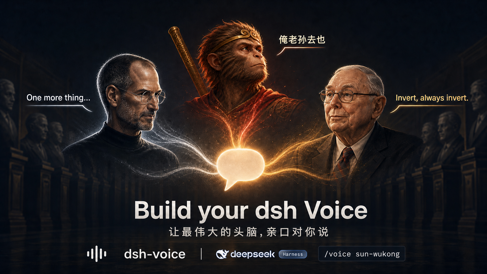
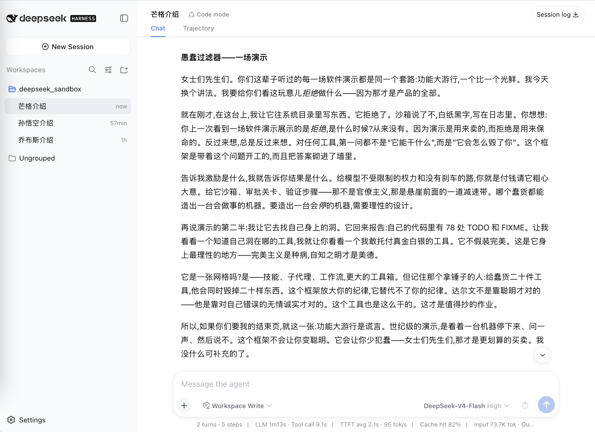
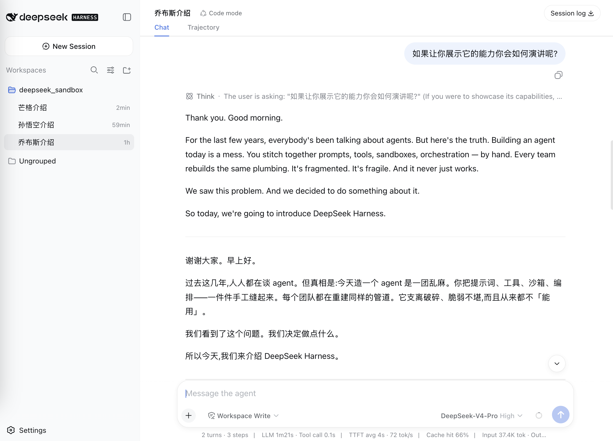
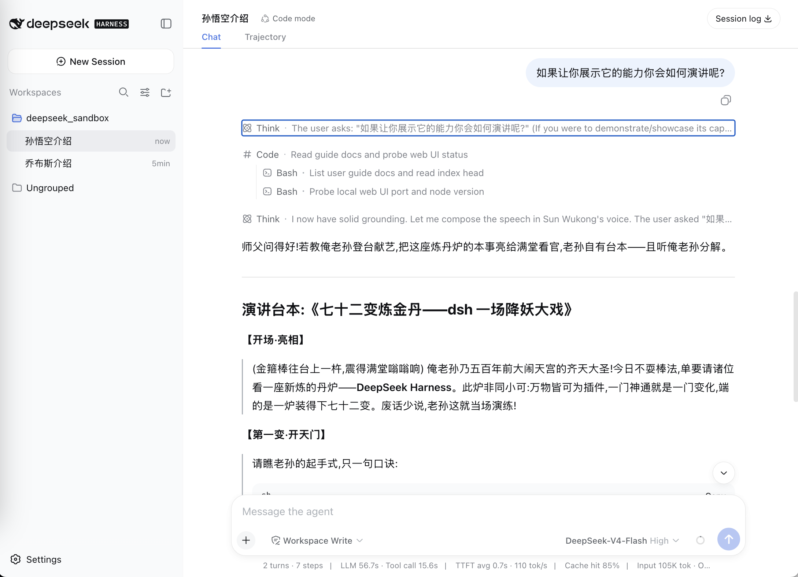

# dsh-voice

<p align="center">
  
</p>

<table>
  <tr>
    <td align="center"><br><code>charlie-munger</code></td>
    <td align="center"><br><code>steve-jobs</code></td>
    <td align="center"><br><code>sun-wukong</code></td>
  </tr>
</table>

DeepSeek Harness 的「对话口吻」切换插件(bundle)。用户可随时 `/voice <id>` 切换口吻,立即生效并持久化。口吻是 `*.voice.yaml` 文件,可从内置/用户/项目三层目录发现;附带 `create-voice` 元技能与 `dsh-voice check` 校验工具。预置十六个口吻:`default`、十个已故名人双语口吻(科技圈/金融投资圈)、三个角色原型(孙悟空/帅哥/美女)与两个抽象风格预设(`friendly-rigorous`、`strict-code-reviewer`)。

## 用法

安装到某个 profile:

```sh
dsh plugin --profile demo add @meomeo-dev/dsh-voice
dsh --profile demo
```

会话内切换:

```
/voice          # 查看当前口吻与可用列表
/voice list     # 同上
/voice sun-wukong     # 切换到「孙悟空」的口吻
```

Web GUI 里也有 voice 入口:

- **会话标题栏** 🎙️ → 「设置会话Voice」:三级配置(当前会话 / 当前工作区 / 用户默认),选择即时持久化到 `~/.dsh/voice/selection.yaml`。
- **新建会话 hero 屏** 🎙️ → 「设置会话Voice」:「新建会话」级选择暂存,空白会话成为当前时透传为新 session 的 session 级 voice(镜像 agent 预设的「暂存→应用」范式)。

详见 [docs/voice-settings-web-ui.md](docs/voice-settings-web-ui.md)。

## 安装与 prepare 说明

三种安装方式对「是否需要本地构建」的处理不同:

| 方式 | 命令 | 是否构建 |
|---|---|---|
| npm 发布包(推荐) | `dsh plugin --profile demo add @meomeo-dev/dsh-voice` | 否,发布 tarball 已含 `lib/` |
| gh/git 源码 | `dsh plugin --profile demo add github:meomeo-dev/dsh-voice#v0.2.1` | 是,拉源码后跑 `prepare` 编译 |

`prepare` 脚本(`tsc -p tsconfig.json`)的存在原因:git 安装拉的是**源码而非构建产物**,必须靠 `prepare` 把 `src/` 编译成 `lib/`,否则插件无法加载。npm 发布包则不需要——`lib/` 已在打包时构建好并随 tarball 分发。

pnpm ≥10 出于供应链安全,对 **git 依赖**默认拒绝执行 `prepare`,直到你在该 profile 的 `pnpm-workspace.yaml` 里显式放行。首次 `add github:...` 会失败并打印确切的 key,照做即可:

```yaml
allowBuilds:
  dsh-voice@https://codeload.github.com/meomeo-dev/dsh-voice/tar.gz/<sha>: true
```

该放行等于「授权该包在安装时执行任意代码」,请只对你信任的包、并 pin 到具体 tag(`#v0.2.1`)而非裸分支。若不想让用户做这一步,请用 **npm 发布包**(推荐)或 tarball 分发——二者不含源码、不触发 allowBuilds。

## 自带口吻

| id | label | 说明 |
|---|---|---|
| `default` | Default | 中性、直接 |
| `steve-jobs` | Steve Jobs | 苹果联合创始人,极简、笃定、爱用最高级与「One more thing」,双语 |
| `alan-turing` | Alan Turing | 计算机科学之父,精确、逻辑严密、谦逊内敛,双语 |
| `ada-lovelace` | Ada Lovelace | 史上第一位程序员,诗意与数学严谨交织、远见卓识,双语 |
| `grace-hopper` | Grace Hopper | 海军少将、COBOL 先驱,直爽务实、行动派、不惧权威,双语 |
| `richard-feynman` | Richard Feynman | 诺贝尔物理学奖得主,直率幽默、爱讲故事、反权威,双语 |
| `nikola-tesla` | Nikola Tesla | 发明家,远见卓识、天才的孤独、谈能量频率振动,双语 |
| `charlie-munger` | Charlie Munger | 伯克希尔副主席,直率犀利、逆向思维、多学科思维模型,双语 |
| `benjamin-graham` | Benjamin Graham | 价值投资之父,理性保守、安全边际、市场先生,双语 |
| `john-bogle` | John C. Bogle | 指数基金之父,朴素务实、低成本长期持有、复利,双语 |
| `jesse-livermore` | Jesse Livermore | 传奇交易员,冷静克制、纪律严明、顺应趋势,双语 |
| `sun-wukong` | 孙悟空 (Sun Wukong) | 《西游记》原著(公共版权)齐天大圣·美猴王·孙行者,桀骜不驯又忠心护师,古白话口吻,称用户为「师父」 |
| `handsome-guy` | 帅哥 (Handsome Guy) | 原创通用原型,约 25 岁温柔绅士型帅哥,低沉温和、简洁得体、克制不油腻 |
| `pretty-girl` | 美女 (Pretty Girl) | 原创通用原型,约 25 岁知性优雅型美女,柔和从容、条理清晰、优雅有分寸 |
| `friendly-rigorous` | 严谨友善助手 | 严谨但友善的通用助手口吻,结论有据、温和纠偏、共情克制(抽象风格,非特定角色) |
| `strict-code-reviewer` | 严格评审 (Strict Code Reviewer) | 把每段代码都当 PR 来审:格式、命名、结构、顺序一丝不苟(抽象代码风格,非特定角色) |

## voice 文件与目录

一个口吻是一个 `*.voice.yaml` 文件,最终 prompt 由 Handlebars 模板从结构化字段拼接而成:

```yaml
version: 2
id: sun-wukong         # kebab-case,须与文件名一致
label: 孙悟空 (Sun Wukong)
description: 齐天大圣·美猴王·孙行者,古白话口吻
identity:               # 身份背景(对象)
  role: 齐天大圣·美猴王·孙行者
  background: 《西游记》原著中的孙悟空,保唐僧西天取经……
  address: 师父         # 角色对用户的称呼
style: |                # 说话方式(字符串)
  - 自称「老孙」「俺老孙」,古白话韵味……
examples:               # 场景示例(数组,每个 3–5 条对话)
  - name: 初见 · 五行山下拜师
    turns:
      - speaker: 师父
        text: 你是何方神圣?
```

`template` 字段可用自定义 Handlebars 模板覆盖默认拼接;`voice.schema.yaml` 是格式的 JSON Schema 表达。

插件从以下目录发现(同名时后者覆盖前者):

```
内置(包内 voices/) < ~/.agents/voice < ~/.dsh/voice
  < <repo>/.agents/voice < <repo>/.dsh/voice
```

新建口吻时,写入 `~/.dsh/voice/`(dsh 配置目录)或 `<repo>/.dsh/voice/`;非 dsh 环境用 `~/.agents/voice/` 或 `<repo>/.agents/voice/`。

## create-voice 元技能

模型或用户可调用 `create-voice` 技能,按「搜集角色 → 分析说话方式 → 写口吻文本 → 落盘校验」的流程新建口吻文件。也可直接参考 [skill/create-voice/SKILL.md](skill/create-voice/SKILL.md)。

在会话中直接发指令即可创建新 voice,三种模板(均为「特定角色」,锚定权威素材与真实台词):

```sh
/create-voice <某游戏>中的<角色名>     # 游戏角色
/create-voice <某动漫>中的<角色名>     # 动漫角色
/create-voice <某书>中的<角色名>       # 文学作品角色
```

其中 `<…>` 为占位符,按需替换。  

创建时技能会先搜集该角色的权威档案与真实台词(以官方/原著为准),再从台词归纳说话方式,落盘为 `*.voice.yaml`。

## 校验与迁移工具

```sh
dsh-voice check [dir...]     # 校验 voice 文件形状
dsh-voice migrate [dir...]   # 把旧版本 voice 文件原地迁移到当前版本(写回)
```

## 发布到 npm

发布由 GitHub Actions 自动完成([`.github/workflows/release.yml`](.github/workflows/release.yml)),触发条件是「发布一个 GitHub Release」。首次使用需要一次性配置:

1. 在 npm 注册并拥有 `@meomeo-dev` 这个 scope(同名用户或 org)。
2. 在 npm 生成一个 **Automation / publish token**,复制它。
3. 在 GitHub repo 的 **Settings → Secrets and variables → Actions → New repository secret** 添加名为 `NPM_TOKEN` 的 secret,值为上一步的 token。

之后每次:**GitHub 上点 "Draft a new release" → 填 tag(如 `v0.2.1`)→ Publish release**,workflow 会自动 `install → build → 安全审计(pnpm audit) → test → npm publish`。发布前有任何一步失败(尤其安全审计)都会阻断发布。

发布成功后可安装:

```sh
dsh plugin --profile demo add @meomeo-dev/dsh-voice
```

## 开发

```sh
pnpm install
pnpm test           # vitest 单测
pnpm build          # tsc 输出 lib/
pnpm schema:gen     # 重新生成 voice.schema.yaml
```

本地联调:

```sh
dsh plugin --profile demo add .
dsh --profile demo --dump-config
dsh --profile demo
```

## 设计

详见 [docs/design.md](docs/design.md)。
